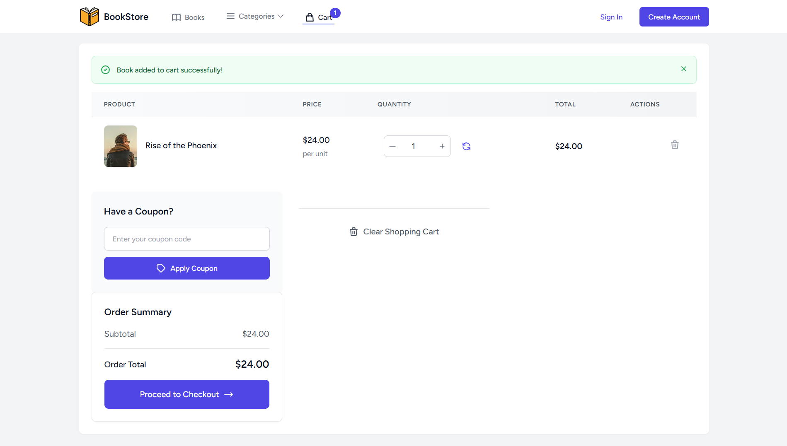

# 📚 Book Store

A Laravel-based web application for an online bookstore.  
It provides a platform for users to browse and purchase books, and for administrators to manage inventory, orders, and promotions.

---

## 🌟 Preview

### Homepage


### Book Details


### Shopping Cart



### Apply Coupons


### Checkout


### Order History


### Admin Dashboard


### Admin Coupons


### Admin Category


### Admin Books


## ✨ Features

### User Features

-   **Browse Books:** View all available books with title, author, price, and description.
-   **Filter by Category:** Quickly find books in a selected category.
-   **Shopping Cart:** Add, update, or remove books before purchase.
-   **Coupon System:** Apply discount coupons.
-   **Secure Checkout:** Stripe-powered payment process.
-   **Order History:** Review all past orders.
-   **User Profile Management:** Update info and password.

### Admin Features

-   **Dashboard:** Overview of sales, orders, and new customers.
-   **Book Management:** Full CRUD for books.
-   **Category Management:** Manage categories.
-   **Order Management:** Process customer orders.
-   **Coupon Management:** Create, edit, delete coupons.

---

## 🛠 Built With

-   [Laravel](https://laravel.com/)
-   [PHP](https://www.php.net/)
-   [MySQL](https://www.mysql.com/)
-   [Stripe](https://stripe.com/)
-   [Tailwind CSS](https://tailwindcss.com/)
-   [Vite](https://vitejs.dev/)

---

## 🚀 Installation

### Prerequisites

-   PHP >= 8.1
-   Composer
-   Node.js & npm
-   MySQL (or another database)

### Steps

1. Clone the repository:
    ```sh
    git clone https://github.com/youceeef/book_store.git
    cd book_store
    ```
2. Install PHP dependencies:
    ```sh
    composer install
    ```
3. Install NPM dependencies:
    ```sh
    npm install
    ```
4. Set up `.env`:
    ```sh
    cp .env.example .env
    php artisan key:generate
    ```
    Configure your database & Stripe keys.
5. Run migrations:
    ```sh
    php artisan migrate
    ```
6. Build assets:
    ```sh
    npm run dev
    ```
7. Start server:
    ```sh
    php artisan serve
    ```

---

## 🧪 Testing

```sh
php artisan test
```
